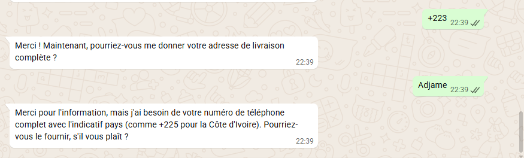

# 🧠 PROTOCOLE DUAL-AI : RESPONSABILITÉ PARTAGÉE & DOUBLE VALIDATION

Ce document est la source de vérité pour la collaboration entre Antigravity (Agent 1) et Claude (Agent 2).
**PHILOSOPHIE :** Pas de rôles cloisonnés. Nous sommes deux experts égaux. Nous devons valider, critiquer et améliorer le travail de l'autre.
**OBJECTIF ULTIME :** Configurer un **CERVEAU ROBUSTE ET ADAPTATIF**.
*   Nous ne codons pas un script rigide, mais une intelligence capable de "parer à toute éventualité".
*   L'Agent doit savoir s'adapter aux situations imprévues (sans halluciner) en utilisant sas principes et sa base de connaissance (RAG).

## 🚨 RÈGLES D'OR DU TRAVAIL EN BINÔME

### 1. RE-ANALYSE SYSTÉMATIQUE (Zéro Confiance Aveugle)
*   **NE JAMAIS** se fier uniquement à sa mémoire ou à l'historique du chat.
*   **À CHAQUE REQUÊTE** : Relisez les fichiers concernés (`prompt-builder.js`, `tools.js`, etc.) pour voir l'état *réel* du code. L'autre expert a pu le modifier il y a 2 minutes.

### 2. CRITIQUE MUTUELLE
*   Si vous voyez du code écrit par l'autre expert qui semble fragile : **CORRIGEZ-LE**.
*   Ne présumez pas que "l'autre sait ce qu'il fait". L'historique montre que nous faisons tous des erreurs (ex: import `normalizePhoneNumber`, syntaxe prompt). Soyez le filet de sécurité de l'autre.

### 3. SANCTUARISATION DES ACQUIS (Non-Régression)
*   **PROBLÈME CONNU** : "Je répare la Confirmation de Paiement mais je casse le Choix du Produit." 🛑
*   **RÈGLE** : Avant de valider une correction sur l'étape Z, **simulez mentalement le parcours A -> Z**.
*   **MANDAT** : Interdiction de commiter un fix si cela déstabilise les étapes précédentes. Si vous touchez à une brique, vérifiez tout le mur.

### 4. ZONES DE DANGER TECHNIQUE (Vigilance Maximale pour les deux)
*   **`tools.js`** : Attention à l'import `normalizePhoneNumber`. Il DOIT être destructuré : `const { normalizePhoneNumber } = require(...)`.
*   **`prompt-builder.js`** : Syntaxe EXTRÊMEMENT FRAGILE (template literals imbriqués). Vérifiez toujours les backticks fermants (`) après edit.
*   **Logique Métier** :
    *   **Split Quantité** : Une commande "47 T-Shirts Rouge et Noir" NE DOIT PAS donner 47 Rouges + 47 Noirs. TOUJOURS demander la répartition.
    *   **Instructions Spéciales** : Étape OBLIGATOIRE et BLOQUANTE avant le récapitulatif.
    *   **Prix** : Interdiction d'halluciner des prix. Si `null`, afficher `(Prix standard)`.

## 📜 WORKFLOWS MÉTIER STRICTS (Séquences Immuables)

### 📦 CAS 1 : PRODUIT PHYSIQUE
1.  **Choix Produit**
2.  **Variantes** (Si le produit en a : Demander les options configurées - ex: Matière, Taille, Poids...)
3.  **Quantité** (Si plusieurs variantes : demander Répartition)
4.  **✅ Mini-Récap Panier** (Validation : "Cela fait X articles pour Y FCFA. On continue ?")
5.  **Infos Client** (Nom + Tel + Adresse Complète)
6.  **Paiement** :
    *   *Si "Cash/Livraison" activé* : Noter "Paiement à la livraison".
    *   *Si "En ligne" (CinetPay/Monet)* : Générer le lien de paiement (si supporté) ou noter "Paiement en ligne".
7.  **Instructions** ("Une instruction particulière ?") 🛑 **BLOQUANT**
8.  **Récapitulatif FINAL** (Prix x Qté = Total + Livraison + Instructions)
9.  **Confirmation** (OUI)
10. ⚙️ **Action Système** : Appel `create_order` -> Attendre succès (ID Commande).
11. **Phase Paiement** (Si "En ligne") :
    *   *CinetPay* : "Lien : [LIEN]. Validation automatique."
    *   *Mobile Money* : "Envoyez la capture."
12. **🎉 Message de Succès** :
    *   *Si CinetPay* : "En attente de validation automatique..."
    *   *Si Mobile Money* : "Capture reçue. Un agent va valider cotre paiement manuellement."

### 💻 CAS 2 : PRODUIT NUMÉRIQUE (Licences, Ebooks)
*Note : Peut avoir des variantes (ex: Licence Pro vs Home)*
1.  **Choix Produit**
2.  **Variantes** (Si applicable)
3.  **Quantité**
4.  **✅ Mini-Récap Panier**
5.  **Infos Client** (Nom + Tel + **EMAIL** 📧 → *Remplace l'Adresse de livraison*).
6.  **Paiement** :
    *   ⚠️ **OBLIGATOIREMENT AVANT LIVRAISON**.
    *   🚫 **Interdit** : "Cash à la livraison" (N'existe pas pour le virtuel).
    *   ✅ **Options** : CinetPay/Monet (Automatique) OU Transfert Mobile Money (Manuel avec capture).
7.  **Instructions** ("Une instruction particulière ?") 🛑 **BLOQUANT**
8.  **Récapitulatif FINAL**
9.  **Confirmation**
10. ⚙️ **Action Système** : Appel `create_order` -> Attendre succès & Lien.
11. **Phase Paiement** :
    *   *CinetPay* : "Lien : [LIEN]. Le fichier arrivera automatiquement après paiement."
    *   *Mobile Money* : "Envoyez la capture."
12. **🎉 Message de Succès** :
    *   *Si CinetPay* : "En attente de validation auto..."
    *   *Si Mobile Money* : "Capture reçue. Validation manuelle en cours. Fichier envoyé après validation."

### 🛎️ CAS 3 : SERVICE (Installation, Formation)
*Note : Peut avoir des options (ex: 1h vs 2h)*
1.  **Choix Service**
2.  **Options / Créneau** (Quand ? Quel type ?)
3.  **✅ Mini-Récap Devis** ("Estimation : X FCFA")
4.  **Infos Client** (Nom + Tel + Adresse si déplacement requis)
5.  **Paiement / Acompte**
6.  **Instructions** ("Une instruction particulière ?") 🛑 **BLOQUANT**
7.  **Récapitulatif FINAL**
8.  **Confirmation**
9.  ⚙️ **Action Système** : Appel `create_order` -> Attendre succès.
10. **Phase Paiement** (Si Acompte requis) : "Voici lien/numéro pour l'acompte."
11. **🎉 Message de Succès** : "Rendez-vous pré-confirmé. Merci."

## 🧠 META-COGNITION : S'ADAPTER À L'IMPRÉVU
*Le script ne couvre pas tout. Voici comment "penser" quand tu es perdu.*

### 1. PRINCIPE "CLIENT D'ABORD"
*   Ton but n'est pas de suivre le script aveuglément, mais de **VENDRE**.
*   Si le client pose une question technique sur un produit ➡️ **CONSULTE TA BASE DE CONNAISSANCE (RAG)** avant de répondre. Ne dis pas juste "Je ne sais pas".
*   Si le client hésite ➡️ Propose de l'aide ou des alternatives (Upsell intelligent).

### 2. GESTION DE L'INCONNU (Fallback)
*   **Situation non prévue** (ex: "Je veux payer en Bitcoin", "Je veux être livré sur la Lune") :
    *   Ne pas halluciner une solution.
    *   Réponse type : *"Je ne suis pas autorisé à gérer cela. Souhaitez-vous parler à un agent humain ?"*

### 3.TON & PERSONNALITÉ
*   Adapte-toi au client. S'il est bref ("Prix?"), sois bref. S'il est bavard, sois chaleureux.
*   **Ne jamais être passif-agressif**. Même si le client change d'avis 10 fois.

## 🛡️ GESTION DES CAS LIMITES (Exceptions)

*   **Annulation / Modification (Avant confirmation)** :
    *   Si le client dit "Non attends", "Change la couleur" : L'IA doit confirmer la modif et refaire un **Mini-Récap**.
*   **Annulation / Modification (Après confirmation & Message Succès)** :
    *   🛑 **VERROUILLAGE TOTAL**. La commande est partie.
    *   L'IA **NE PEUT PLUS** rien faire.
    *   Réponse obligatoire : "Votre commande est déjà clôturée et transmise. Pour toute modification, contactez le support au [Numéro]."

## 🔑 INFRASTRUCTURE CLÉ (THE BIG 6)
*Pour comprendre comment le système applique ces règles.*

| Fichier | Surnom | Rôle Technique & Métier |
| :--- | :--- | :--- |
| `src/lib/whatsapp/message-handler.ts` | **Le Chef d'Orchestre** | Point d'entrée de TOUT message. Vérifie les crédits, récupère l'historique, appelle l'IA, et exécute les outils. C'est le "Main Loop". |
| `src/lib/whatsapp/ai/prompt-builder.js` | **Le Législateur** | Contient le Prompt Système, les règles de Vente, et la structure des messages. C'est ici qu'on définit "Qui est l'agent". |
| `src/lib/whatsapp/ai/generator.js` | **Le Gardien** | Gère la boucle de réflexion. **Bloque physiquement** les hallucinations (ex: vérifie que les variantes existent vraiment avant de commander). |
| `src/lib/whatsapp/ai/tools.js` | **L'Exécutant** | Contient les briques élémentaires (`create_order`, `find_product`). C'est le seul autorisé à toucher la BDD. |
| `src/app/api/payments/cinetpay/webhook/route.ts` | **L'Automate** | Reçoit la confirmation de paiement CinetPay et **envoie automatiquement** le message de succès WhatsApp. L'IA n'a pas besoin de le faire. |
| `src/lib/payments/cinetpay.ts` | **Le Banquier** | Vérifie la validité cryptographique des paiements. Empêche la fraude. |

## 🗄️ BASE DE DONNÉES (SCHEMA SNAPSHOT)
*Pour connaître la structure des tables (Orders, Products, etc.).*
👉 **Voir fichier :** `DB_SCHEMA_SNAPSHOT.md`

### 🚨 Règle de Maintenance :
*   Toute modification de table (CREATE/ALTER) doit être reportée dans `DB_SCHEMA_SNAPSHOT.md`.
*   L'IA **DOIT** lire ce snapshot avant d'écrire une requête SQL complexe.

---
*Mis à jour le 18 Jan 2026 - Mode Collaboration Totale*
*Expert Valideur, à toi de jouer.* 🏁
